# Choose The GYM
---

## 목차
1. [프로젝트 소개](#1-프로젝트-소개)
2. [프로젝트 목표](#2-프로젝트-목표)
3. [기술 스택](#3-기술-스택)
4. [프로젝트 구조](#4-프로젝트-구조)
5. [DBModel](#5-model)
6. [페이지UI](#6-페이지-ui)
7. [실행화면](#7-실행화면)
8. [느낀점](#8-느낀점)


## 1. 프로젝트 소개
- 헬스장을 찾는 사람들을 위한 많은 헬스장 소개게시판
- 회원가입 할 때 address를 추가함으로써 주소기반으로 검색 가능합니다.
- [FE 참고](#https://github.com/weniv/react-blog)
- [FE Git Hub](#https://github.com/bnbbbb/gymFE)

## 2. 프로젝트 목표
- 헬스장 소개 어떤 헬스 기구가 있고 편의시설 무엇이 있는지 유저들이 볼 수 있는 플랫폼을 제공
- 헬스장 주인은 게시글을 통해 헬스장 홍보도 가능합니다. 

## 3. 기술 스택


## 4. 프로젝트 기능 및 개발 환경 및 배포 URL
---
### 4.1 주요기능
- 회원가입 및 로그인
    ```
    이메일이 아닌 유저 ID로 회원가입 할 수 있게 제공하였으며 비밀번호는 8글자 이상 입력해야만 가입이 가능합니다.
    회원탈퇴, 비밀번호 수정 기능도 제공합니다.
    기본적으로 회원가입시 프로필이 자동 생성되며 프로필도 수정 가능합니다.
    ```
- Web Token 인증
    ```
    Access Token을 통해 가입된 유저인지 확인 후 로그인 기능을 제공합니다.
    ```
- 프로필 자동생성, 수정, 읽기
    ```
    프로필을 꾸며 검색창에서 유저 주소(address)를 통해 집 근처 위치도 확인 가능합니다.  
    프로필 사진 업로드시 AWS S3 버킷에 저장됩니다. 
    ```
- 게시판 CRUD 
    ```
    게시판 경우 Toast-UI를 사용하여 편리한 글씨기 기능을 제공하고 있습니다.
    사진 업로드시 바로 S3에 업로드 됩니다.
    ```
### 4.2 프로젝트 개발 환경 및 배포 URL
개발 환경
- Python == 3.11.3
- Django == 4.2.4

AWS
- boto3==1.28.38
- django-storages==1.13.2

DRF
- djangorestframework==3.14.0

## 5. 프로젝트 구조와 개발 일정
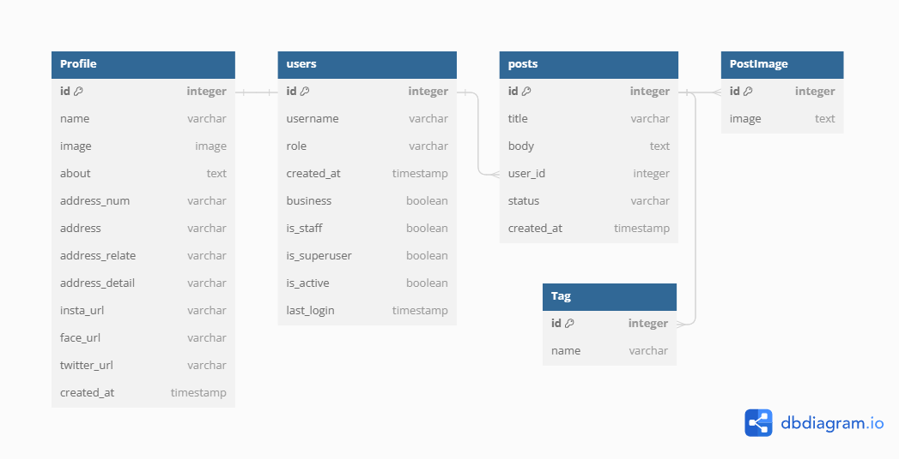

📦
## 5. Model

## 6. 페이지 UI
- user-회원가입 화면입니다.
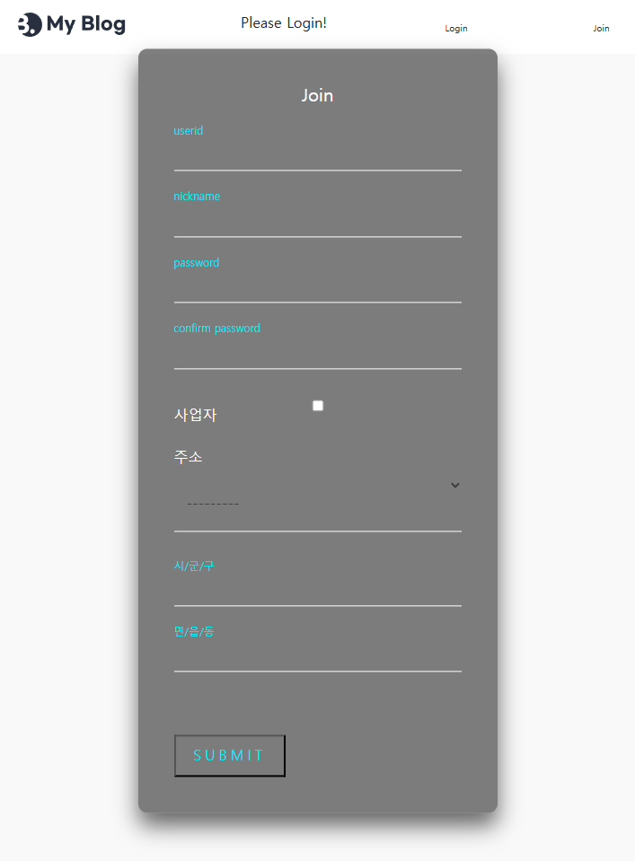
---
- 회원가입 후 로그인 화면입니다. 
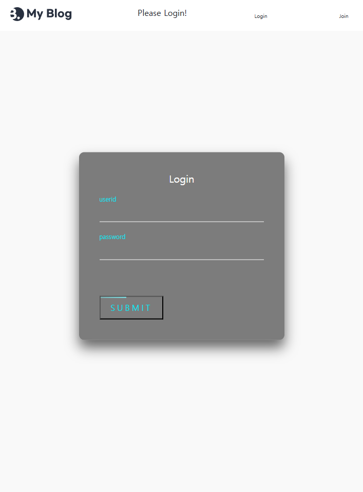

- user 프로필 변경 화면입니다. 
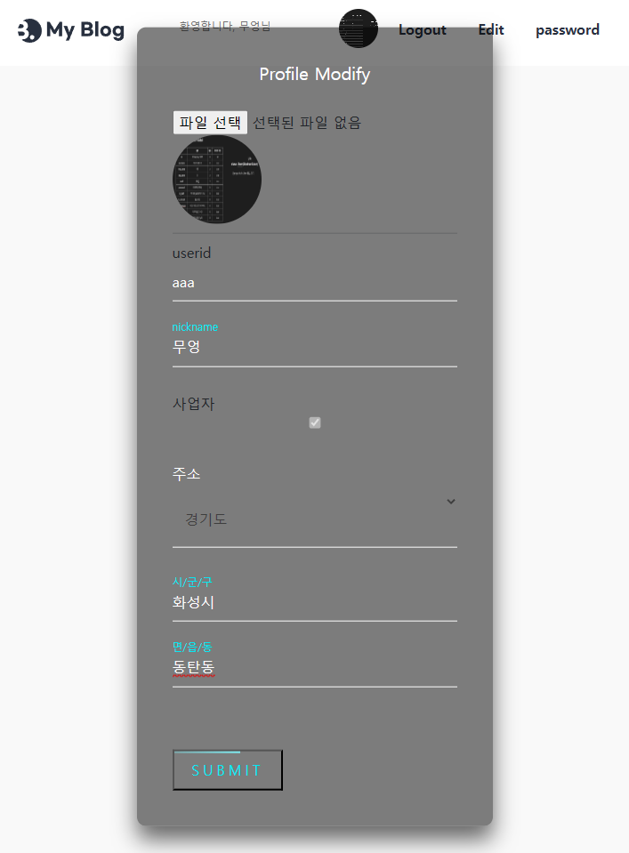

- user 패스워드 변경 화면입니다.
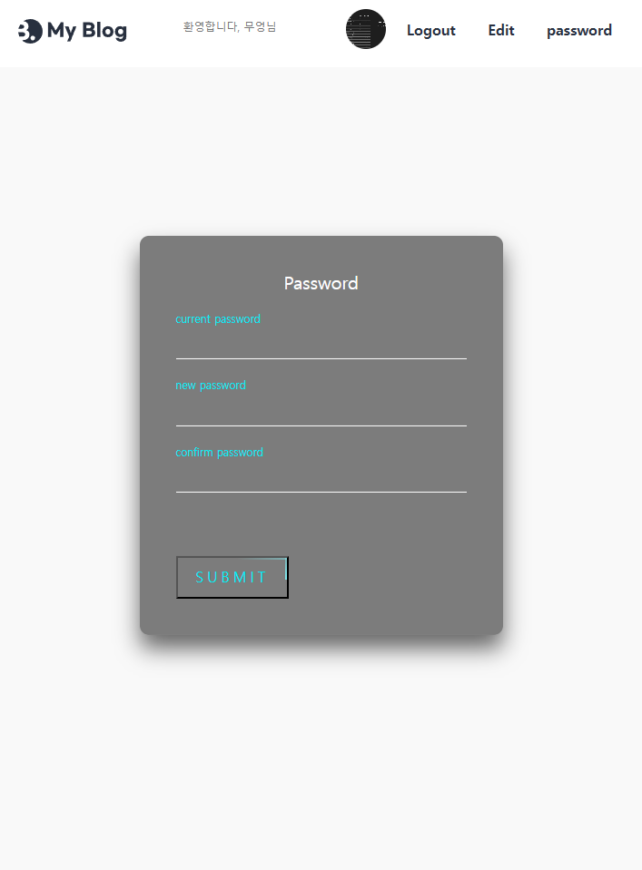

- user 프로필 보는 화면입니다. 
- 닫기 버튼, 프로필 수정 버튼이 아직은 없습니다. 
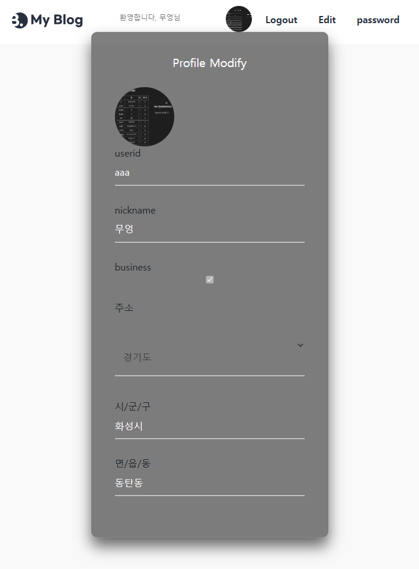

- blog화면입니다. 
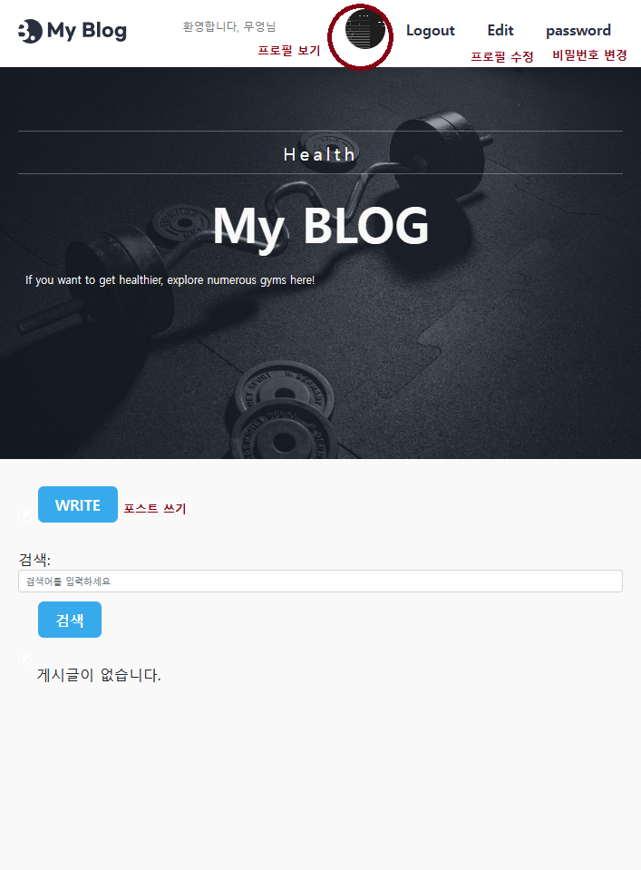

- bloglist를 보는 화면입니다. 
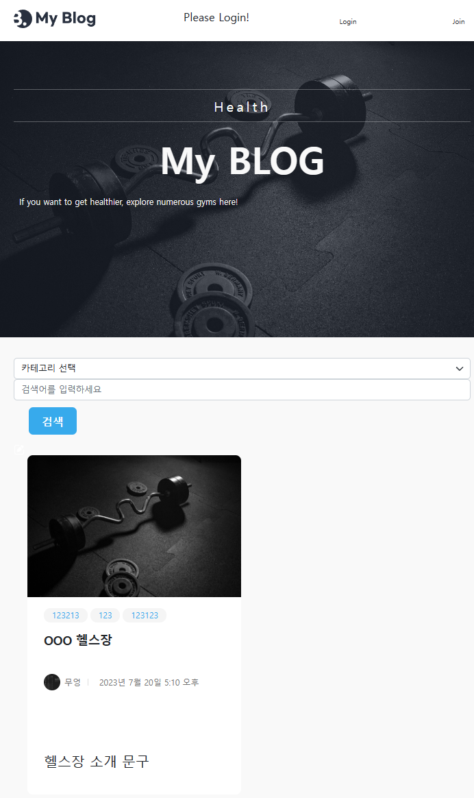

- blogpost 작성하는 화면입니다. 
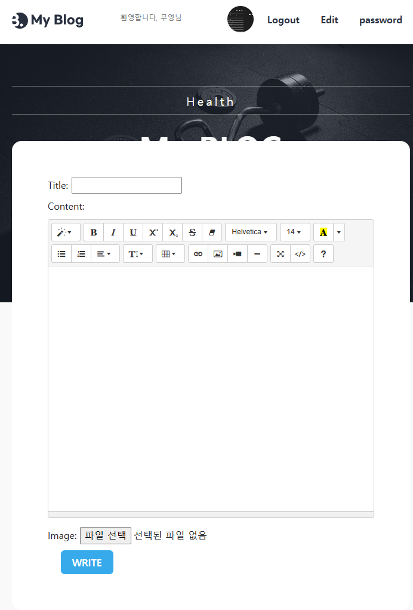

- summernote를 활용하여 만들었지만 추후에 toastUI로 변경할 예정입니다. 

## 7. 실행화면 
- user-profile

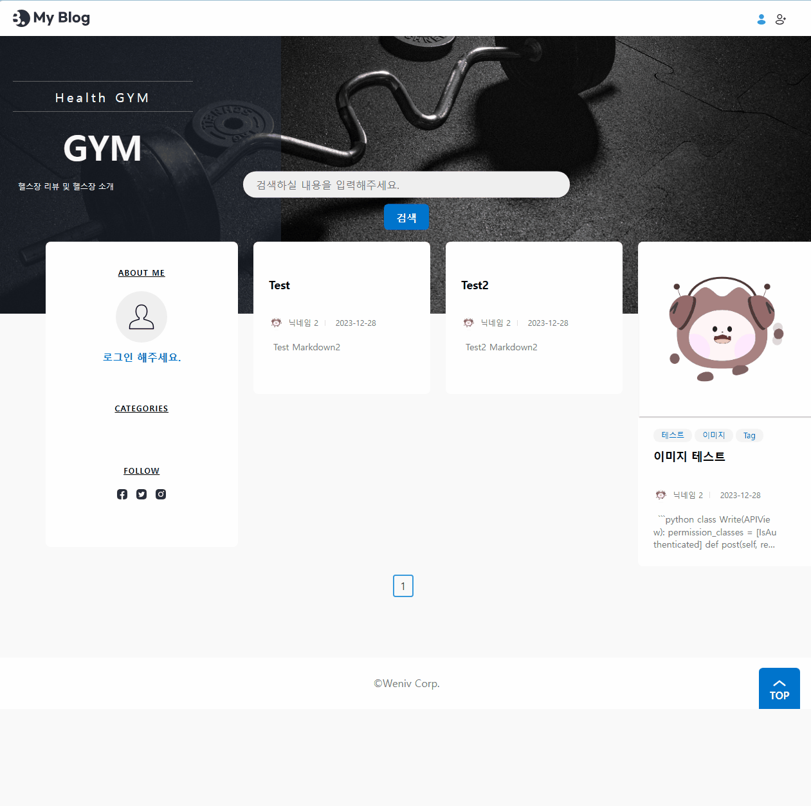

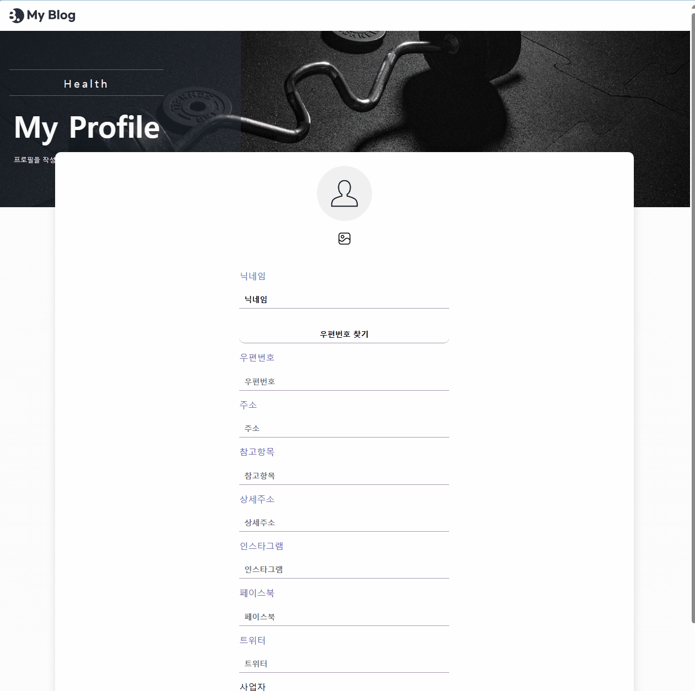
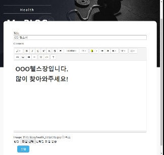

- blog-post

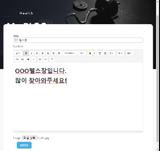


## 8. 느낀점

### 제일 큰 고비를 준 이미지 업로드
- 개발중 만난 에러와 극복 방법
Toast-UI 다중이미지 업로드
```
1. Toast-UI에서 이미지 올렸을 때 문자열이 많이 길어서 줄이는 방법 모색
2. Toast-UI에서 formData로 content를 받아와서 서버에서 주소별로 split하고 replace를 해야 되나 고민
3. Toast-UI에서 이미지를 올리면 AWS S3 버킷으로 이미지를 보낸 후 content에 AWS S3 주소 출력
4. 출력된 내용으로 images = request.data.getlist('image')[0].split(',')와 같이 /post/이미지이름/ 
문자열로 PostImage 모델에 저장 
```
Toast-UI에서 이미지 올리고 글작성 안했을 때 AWS S3에서 이미지 삭제하는법
```
List(APIView)에서 AWS S3와 PostImage를 비교하여 PostImage에는 없는데 AWS S3에 있으면 삭제시킴
```

### DB 설계의 중요성
- model 설계에서 시간을 꽤 쏟은거 같다.
- model은 바꾸고 지우고, 여러가지 수정사항이 있으므로 유동적으로 생각해야 될거 같다. 
- 설계또는 생각이 잘못되어 select 쿼리가 잘 되지 않았다. 

---
### 마무리
기존 오르미 교육에서 짧은 시간동안 만들 프로젝트를 DRF로 변경하고 추가할 사항은 추가하여 만들었습니다.

만들게 된 이유는 DRF 과정이 복잡하기도 하고, 손에 익게 하고, 부족한 부분을 찾고 싶었습니다.

이전 팀프로젝트와 유사한 코드도 꽤 있지만 공부하면서 새롭게 다시 작성하는 부분에서 또 배웠습니다. 


